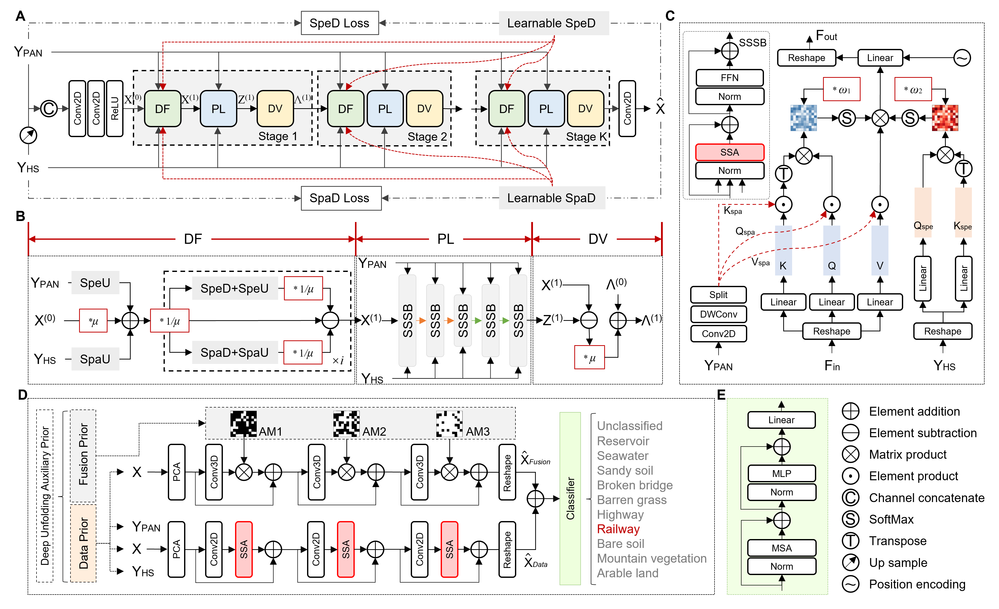

# PUT-PDN

Official code preparation for **“Physics-Constrained Fusion and Prior-Guided Classification Framework for Remote Sensing Perception”**, published in *Information Fusion* (2026), article 104624. [https://doi.org/10.1016/j.inffus.2026.104624](https://doi.org/10.1016/j.inffus.2026.104624)

[中文说明](README_zh-CN.md)



**Figure 1.** The proposed physics-constrained fusion and prior-guided classification framework.

## Overview

The **Physics-Constrained Unfolding Transformer (PUT)** reconstructs a high-resolution hyperspectral image from a low-resolution HSI and a high-resolution PAN observation. PUT combines:

- a physics-constrained unfolding process based on the sensor observation model;
- a truncated high-order Neumann expansion for efficient data-fidelity updates;
- a Spatial-Spectral Synergy Block for PAN-conditioned spatial-spectral representation learning;
- learnable spatial and spectral degradation operators;
- observation-consistency supervision in the PAN and LR-HSI domains.

The current repository contains the complete PUT fusion implementation. A complete runnable PDN classification implementation was not present in the audited fusion experiment directories and is therefore not included in this release preparation.

## Reproduced results

The public PUT code was evaluated with the paper checkpoints and original test data on NVIDIA Tesla V100S GPUs. The metric implementation uses the same `imgvision==0.1.7.3` backend as the paper experiments.

| Dataset | Stages | PSNR | SSIM | SAM | ERGAS | RMSE | Paper match |
|---|---:|---:|---:|---:|---:|---:|:---:|
| Indian | 3 | 60.01 | 0.9974 | 1.1906 | 0.5911 | 0.0020 | Yes |
| Pavia | 3 | 36.12 | 0.9742 | 4.2595 | 3.2078 | 0.0206 | Yes |
| Chikusei | 5 | 45.68 | 0.9914 | 2.7261 | 4.1207 | 0.0057 | Yes |
| Xiongan | 5 | 47.75 | 0.9961 | 0.9653 | 0.6360 | 0.0049 | Yes |

All 30 rerun metric cells match the published tables after rounding to the displayed precision. Full-precision outputs and environment details are stored in [`results/reproduction_20260719.json`](results/reproduction_20260719.json). The complete comparison with FusionNet, PanFormer, LGPConv, PMACNet, WFANet, GPPNN, LGTEUN, DISPNet, and SSUNNet is available in [`docs/BENCHMARKS.md`](docs/BENCHMARKS.md).

## Installation

The verified environment uses Python 3.9 and PyTorch 2.1. Install the PyTorch build appropriate for your CUDA version first, then install PUT:

```bash
conda create -n put-pdn python=3.9 -y
conda activate put-pdn
# Install the appropriate PyTorch/CUDA build from pytorch.org.
pip install -e .
```

Exact experiment package versions are recorded in [`environment.yml`](environment.yml).

## Data

Datasets are not redistributed. Arrange the source files as described in [`docs/DATASETS.md`](docs/DATASETS.md), then pass the corresponding directory through `--data-root`.

| CLI name | Bands | Epochs | Default stages | Protocol |
|---|---:|---:|---:|---|
| `indian` | 220 | 100 | 3 | simulated |
| `pavia` | 102 | 100 | 3 | simulated/prepared HDF5 |
| `chikusei` | 128 | 300 | 5 | simulated |
| `xiongan` | 93 | 300 | 5 | simulated |
| `ln1` | 166 | 100 | 3 | Wald and real full scene |
| `ln2` | 144 | 100 | 3 | Wald and real full scene |

The paper uses three stages as the primary setting and additionally reports five-stage results. Use `--stage` to select a specific depth.

## Training

The defaults follow the paper protocol: 64×64 HR patches, spatial ratio 4, batch size 10, 100 iterations per epoch, Adam, initial learning rate `2e-4`, and cosine decay to `1e-6`.

```bash
python train_put.py --dataset indian --data-root /path/to/Indian --output runs
python train_put.py --dataset pavia --data-root /path/to/Pavia --output runs
python train_put.py --dataset chikusei --data-root /path/to/Chikusei --output runs
python train_put.py --dataset xiongan --data-root /path/to/Xiongan --output runs
python train_put.py --dataset ln1 --data-root /path/to/Liaoning-1 --output runs
python train_put.py --dataset ln2 --data-root /path/to/Liaoning-2 --output runs
```

The optimization objective is

```text
L = L1(HR-HSI_hat, HR-HSI)
  + 0.1 L1(PAN_hat, PAN)
  + 0.1 L1(LR-HSI_hat, LR-HSI).
```

Checkpoints and JSONL logs are written to `runs/<dataset>/<stage>stages/`. Resume training with `--resume`.

## Evaluation

Evaluate a simulated or Wald-protocol split:

```bash
python test_put.py \
  --dataset chikusei \
  --data-root /path/to/Chikusei \
  --checkpoint /path/to/put_checkpoint.pth \
  --stage 5 --split val
```

Use `--metrics-only` to skip prediction files during benchmark evaluation. For a Liaoning full scene, overlap-tiled inference reduces memory usage:

```bash
python test_put.py \
  --dataset ln1 \
  --data-root /path/to/Liaoning-1 \
  --checkpoint /path/to/put_checkpoint.pth \
  --stage 3 --split full --tile-size 128 --overlap 16
```

Predictions are MATLAB files containing `HSI` in H×W×B layout. Validation writes PSNR, SSIM, SAM, ERGAS, and RMSE to `metrics.json`.

## Project structure

```text
PUT-PDN/
├── assets/figure1_architecture.png
├── figs/fig1.png
├── docs/
│   ├── BENCHMARKS.md
│   ├── DATASETS.md
│   └── IMPLEMENTATION_NOTES.md
├── results/reproduction_20260719.json
├── src/put_pdn/
│   ├── models/put.py
│   ├── data.py
│   ├── train.py
│   ├── evaluate.py
│   ├── inference.py
│   └── metrics.py
├── tools/
├── train_put.py
└── test_put.py
```

## Citation

```bibtex
@article{wang2026putpdn,
  title   = {Physics-Constrained Fusion and Prior-Guided Classification Framework for Remote Sensing Perception},
  author  = {Wang, Bin and Xiong, Xingchuang and Lian, Yusheng and Yu, Kun and Liu, Zilong},
  journal = {Information Fusion},
  year    = {2026},
  pages   = {104624},
  doi     = {10.1016/j.inffus.2026.104624}
}
```

## Release checklist

- add the final PDN source if the repository is released as the complete PUT-PDN framework;
- confirm permission before distributing checkpoints;
- add official dataset links, citations, and licence notes;
- select and add a software licence.

See [`docs/IMPLEMENTATION_NOTES.md`](docs/IMPLEMENTATION_NOTES.md) for the consolidation scope.
